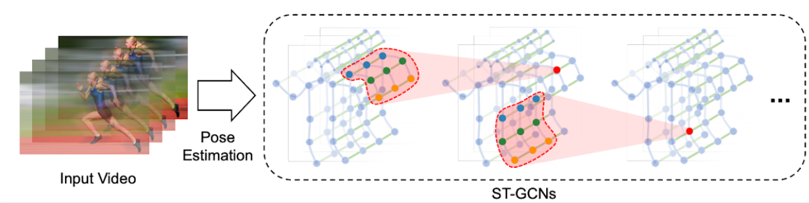
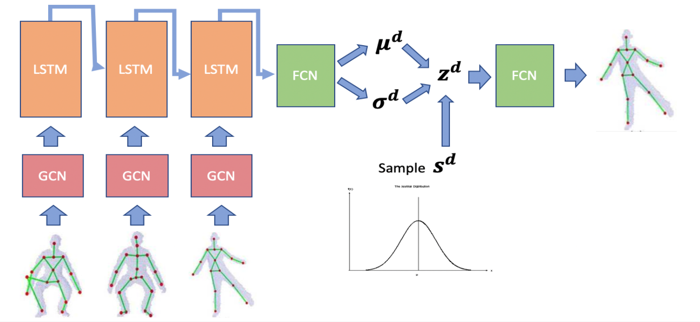
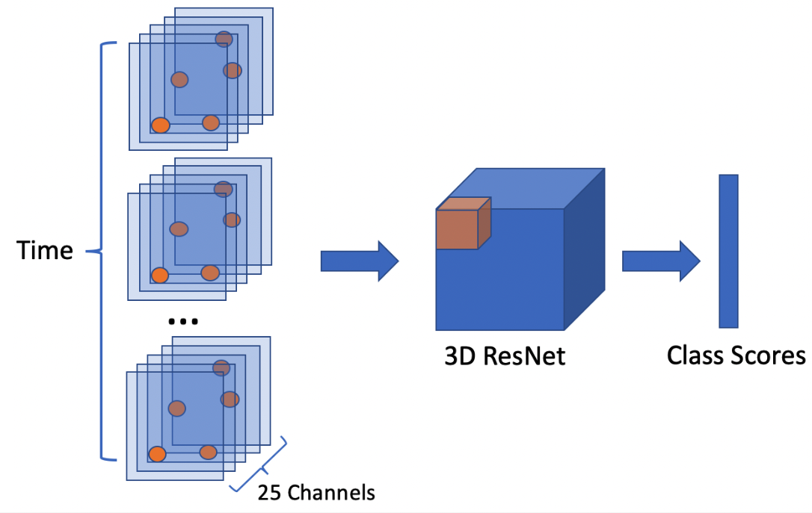

# ActionFromFuturePose
This project uses pose information (can be extracted from openpose) to infer human action in short videos. There are three different models in this code base.

## Why Use Pose?
- Action Recognition using RGB frames can overfit on the background easily
- We tested ResNet and GCN on two datasets each with 3 actions: stand, crouch, walk, pose one tranfered a lot better!

## Spatial Temporal Graph Conv Net [Link](https://arxiv.org/pdf/1801.07455.pdf)
- Spatial edges connect joints
- Temporal edges connect same joint across time
- Proposed different designs for kernels

## Pose-VAE
- Extract features from skeleton at each time step using GCN
- Use an LSTM to predict the next encoded feature

## Spatial Temporal 3D Convolution
- Each joint is represented as a low-res image
- 25 joints are stacked to form a 25 channel image
- Preserves spatial relation between joints

